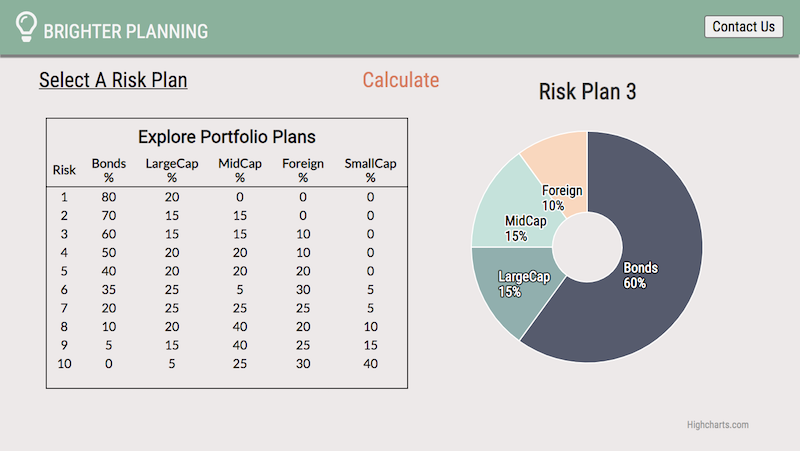
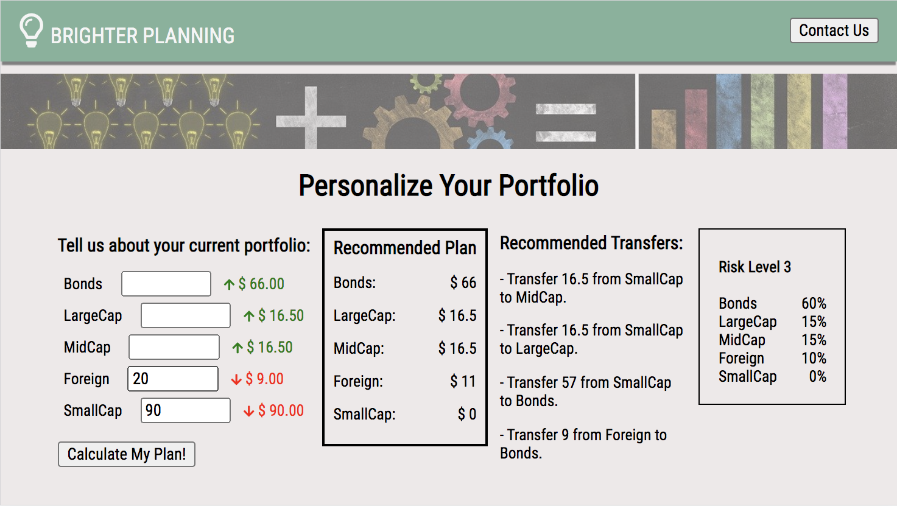

# README

<a href="https://keely-lee.github.io/BrighterPlanning/">BrighterPlanning</a> is a financial tool used to aid the user in reconstructing their portfolio to optimal performance for their risk assessed needs.
 
To run BrighterPlanning on your local computer, download/clone the project to the appropriate directory. In your terminal, navigate to the root directory, and <code>npm install</code>.

At the command prompt <code>cd frontend</code> to get to the frontend folder and <code>npm install</code> once more. When your dependences have been installed, run <code>npm start</code>. If your browswer window doesn't automatically open to <a href="localhost:3000/">localhost:3000/</a>, click the link to open a new window. 

Now you're ready to begin!

As you enter the planning phase, let's first consider the risk plan for your individual needs. For more secure and steady growth, choose a lower plan. If you're able to take more chances at a higher rate, choose a higher plan. Charts display account breakdowns, giving you a chance to gauge the plans for you.

Finally, enter your current portfolio and we'll <a href="http://localhost:3000/#/personalize">calculate</a> the optimized plan for you. BrighterPlanning will render your recommended portfolio and give you a list of recommended transfers to update your portfolio.

### Technologies Used
  * <a href="https://reactjs.org/">React</a> <a href="https://react-redux.js.org/">Redux</a>
  * <a href="https://nodejs.org/en/">Node.js</a>: server-side JavaScript runtime environment with `npm` package manager
  * <a href="https://api.highcharts.com/highcharts/">Highcharts</a>: visual rendering
  * <a href="https://www.papaparse.com/">Papa Parse</a>: parse csv files